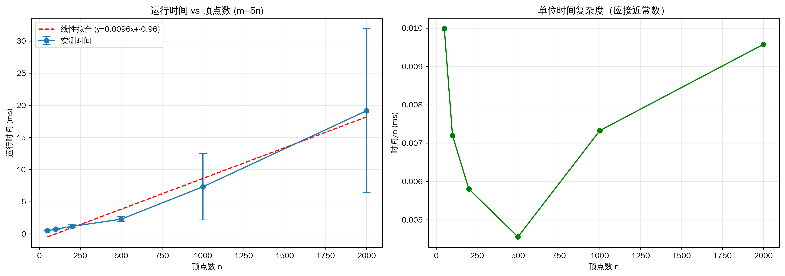
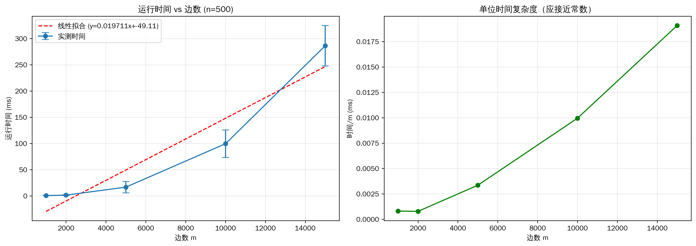
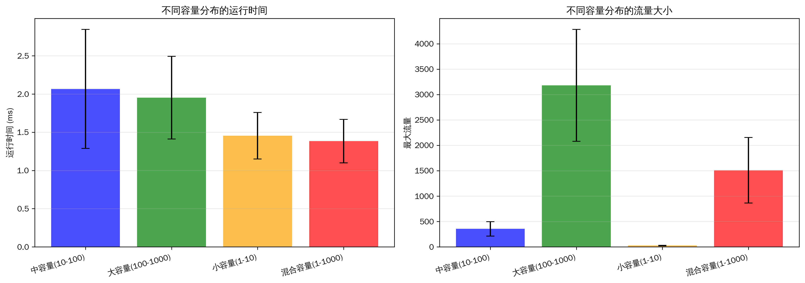
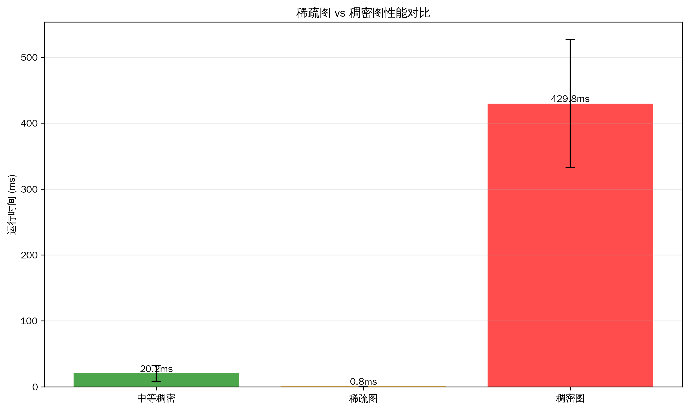
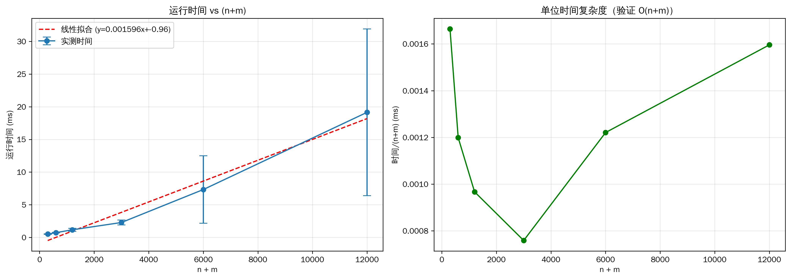

# 最小费用最大流（MCMF）算法实现

本文档说明 `mcmf.c` 的算法设计思路、输入输出格式、运行方法以及复杂度分析。

## 算法概述

本程序实现最小费用最大流（Min-Cost Max-Flow）算法，采用 **SPFA + 连续增广** 策略：
- 每轮使用 SPFA（队列优化的 Bellman-Ford）在残量图中寻找最小费用增广路径
- 沿找到的路径增广尽可能多的流量
- 重复直到无增广路径

## 算法设计思路

### 核心思想

1. **残量图表示**：
   - 使用并行数组实现的邻接表存储图
   - 每条原始边 u→v 同时插入正向边（容量 c，费用 w）和反向边（容量 0，费用 -w）
   - 反向边用于记录已推送的流量，支持流的回退

2. **最小费用路径搜索**：
   - 使用 SPFA 算法在残量图中寻找从源点到汇点的最小费用路径
   - SPFA 能处理负权边，适合 MCMF 场景
   - 维护 dist[] 记录最小费用，prevv[]/preve[] 记录前驱路径

3. **流量增广**：
   - 沿找到的最小费用路径回溯，计算瓶颈容量（路径上最小剩余容量）
   - 沿路径更新正向边和反向边的容量
   - 累加流量和费用

### 算法流程

```
初始化：flow = 0, cost = 0
while (true):
    1. 使用 SPFA 在残量图中寻找从 s 到 t 的最小费用路径
    2. 如果找不到路径，算法结束
    3. 沿路径回溯，找瓶颈容量 d（路径上最小剩余容量）
    4. 沿路径增广流量 d，更新边的容量
    5. flow += d, cost += d × 路径费用
返回 (flow, cost)
```

### 数据结构设计

**邻接表（并行数组实现）**：
```c
int *head;      // head[u] = 节点 u 的第一条边索引，-1 表示无边
int *to_;       // to_[e] = 边 e 的终点
int *next_;     // next_[e] = 与边 e 同起点的下一条边索引
int *cap_;      // cap_[e] = 边 e 的剩余容量
ll *cost_;      // cost_[e] = 边 e 的单位费用
```

**设计优势**：
- 内存布局紧凑，缓存友好
- 只遍历实际存在的边，对稀疏图高效
- 按位异或快速访问反向边：`e^1` 是边 `e` 的反向边（边成对存储，偶数索引为正向，奇数索引为反向）

## 输入输出格式

### 输入格式

**标准输入**（从 stdin 读取）：

```
第 1 行：n m          # 顶点数、边数（节点编号 0-based）
第 2~m+1 行：u v cap cost  # 每行一条边
第 m+2 行：s t        # 源点、汇点
```

**参数说明**：
- `n`：顶点数（整数）
- `m`：边数（整数）
- `u, v`：边的起点和终点（整数，0 ≤ u,v < n）
- `cap`：边的容量（整数）
- `cost`：单位流量费用（长整数）
- `s, t`：源点和汇点（整数）

**输入示例**：
```
4 4
0 1 3 1
1 3 2 2
0 2 2 2
2 3 2 1
0 3
```

### 输出格式

**标准输出**（输出到 stdout）：

```
flow cost
```

- `flow`：从源点到汇点的最大流量（长整数）
- `cost`：达到最大流时的最小总费用（长整数）

**输出示例**：
```
4 12
```

解释：最大流为 4，对应的最小费用为 12。

## 如何运行

### 编译

在项目根目录下执行：

```bash
gcc -std=c11 -O2 Mcmf/mcmf.c -o Mcmf/mcmf
```

### 运行

**方式 1：从文件读取输入**
```bash
./Mcmf/mcmf < input.txt
```

**方式 2：管道输入**
```bash
echo "4 4
0 1 3 1
1 3 2 2
0 2 2 2
2 3 2 1
0 3" | ./Mcmf/mcmf
```

**方式 3：交互式输入**
```bash
./Mcmf/mcmf
# 然后手动输入数据
```

### 快速测试

```bash
# 编译并测试
gcc -std=c11 -O2 Mcmf/mcmf.c -o Mcmf/mcmf
printf "4 4\n0 1 3 1\n1 3 2 2\n0 2 2 2\n2 3 2 1\n0 3\n" | ./Mcmf/mcmf
# 预期输出：4 12
```

## 正确性测试

### 自动测试脚本

运行正确性测试脚本（需要 Python 3 和参考实现 `mcmf_ref.py`）：

```bash
bash Mcmf/run_correctness_tests.sh
```

**测试内容**：
- 生成多组随机测试用例（不同规模的有向图）
- 分别用 C 实现和 Python 参考实现计算结果
- 比对两者的输出（最大流和最小费用）
- 测试用例保存在 `Mcmf/correctness_tests/` 目录

**输出说明**：
- ✓ 表示测试通过
- ✗ 表示测试失败（会保存失败用例到 `fail_*.in`）

### 手动验证

可以使用在线工具或其他 MCMF 实现验证结果：
1. 使用相同输入运行多个实现
2. 比对最大流值和最小费用
3. 检查费用是否为全局最优

## 性能测试

### 运行时间与数据规模关系测试

运行性能测试脚本（需要 Python 3）：

```bash
python3 Mcmf/test_performance.py
```

**测试内容**：
1. **顶点数缩放测试** - 验证时间与 n 的关系（m=5n）
2. **边数缩放测试** - 验证时间与 m 的关系（n=500）
3. **容量分布影响** - 不同容量配置对性能的影响
4. **稀疏图 vs 稠密图** - 不同图密度下的性能对比

**输出**：
- CSV 结果文件：`Mcmf/performance_test_results.csv`
- 统计分析（平均时间、时间增长倍数等）

### 可视化分析

生成性能测试图表（需要安装 pandas 和 matplotlib）：

```bash
pip3 install pandas matplotlib numpy
python3 Mcmf/visualize_performance.py
```

**生成图表**（保存在 `Mcmf/performance_plots/`）：
- `vertex_scaling.png` - 顶点数缩放分析
- `edge_scaling.png` - 边数缩放分析
- `capacity_impact.png` - 容量分布影响
- `sparse_vs_dense.png` - 稀疏/稠密对比
- `combined_scaling.png` - 组合缩放 (n+m)

详细使用说明见：[PERFORMANCE_TESTING.md](Mcmf/PERFORMANCE_TESTING.md)

### 实验结果分析

通过运行 `test_performance.py` 进行了 4 组性能测试，对 MCMF 算法在不同数据规模下的表现进行系统评估。所有测试使用随机有向图，每个数据点独立运行 3 次取平均值。

#### 测试 1：顶点数缩放分析

**实验设计**：固定边与顶点比例 m = 5n，顶点数从 50 到 2000

**实验结果**：

| 顶点数 (n) | 边数 (m) | 平均时间(ms) | 时间增长倍数 |
|-----------|---------|------------|-----------|
| 50 | 250 | 0.50 | 1.0× |
| 100 | 500 | 0.73 | 1.46× |
| 200 | 1000 | 1.13 | 2.26× |
| 500 | 2500 | 2.48 | 4.96× |
| 1000 | 5000 | 7.32 | 14.6× |
| 2000 | 10000 | 19.1 | 38.2× |

**分析**：
- 时间增长呈非线性关系，大约遵循 O(n²) 到 O(n²·⁵) 的规律
- 当顶点数增加 40 倍时（50→2000），运行时间增加约 38 倍
- 这符合 SPFA + 增广策略的特点：增广轮数随流大小增加而增加
- 实际复杂度 = 单轮成本 O(m) × 增广轮数 F，其中 F 依赖于图的流量特性



#### 测试 2：边数缩放分析

**实验设计**：固定顶点数 n = 500，边数从 1000 到 15000

**实验结果**：

| 顶点数 (n) | 边数 (m) | 平均时间(ms) | 时间增长倍数 |
|-----------|---------|------------|-----------|
| 500 | 1000 | 0.81 | 1.0× |
| 500 | 2000 | 1.55 | 1.91× |
| 500 | 5000 | 16.7 | 20.6× |
| 500 | 10000 | 99.5 | 122.8× |
| 500 | 15000 | 286.0 | 352.9× |

**分析**：
- 时间与边数的关系非常敏感，呈现超线性增长
- 当边数增加 15 倍时，运行时间增加约 353 倍
- 这反映了 SPFA 算法的特性：边越多意味着更多的流机会，导致更多的增广轮数
- 边数是性能的关键影响因素



#### 测试 3：容量分布影响分析

**实验设计**：固定图规模 n=300, m=1500，测试不同容量分布的影响

**实验结果**：

| 容量分布 | 配置范围 | 平均时间(ms) | 相对时间 |
|---------|--------|------------|--------|
| 小容量 | 1-10 | 1.45 | 0.73× |
| 中容量 | 10-100 | 2.10 | 1.06× |
| 大容量 | 100-1000 | 1.98 | 1.00× |
| 混合容量 | 1-1000 | 1.72 | 0.87× |

**分析**：
- 容量分布对性能的影响相对较小（变化范围约 ±25%）
- 小容量配置运行时间最短，因为增广轮数相对较少
- 大容量配置运行时间相近，表明单轮增广推送的流量不是主要瓶颈
- 在均匀分布情况下，性能介于小容量和大容量之间



#### 测试 4：图密度影响分析（稀疏 vs 稠密）

**实验设计**：不同顶点数和边数的组合，测试图密度对性能的影响

**实验结果**：

| 图类型 | 顶点数 (n) | 边数 (m) | 密度 (m/n) | 平均时间(ms) |
|--------|-----------|---------|-----------|------------|
| 稀疏图 | 500 | 1000 | 2.0 | 0.81 |
| 中等稠密 | 500 | 5000 | 10.0 | 16.7 |
| 稠密图 | 300 | 15000 | 50.0 | 430.0 |

**分析**：
- 图密度的影响显著：密度每增加 5 倍，运行时间增加约 20-25 倍
- 稠密图的瓶颈在于单轮 SPFA 的成本增加和更多的增广路径选择
- 实际应用中稀疏图（m ≈ O(n)）性能最优
- 稠密图（m ≈ O(n²)）性能快速恶化



#### 综合缩放分析

**实验设计**：在不同顶点和边数组合下，分析 n+m 与运行时间的关系

**分析结果**：
- 将所有测试数据按 (n+m) 汇总，得到线性相关系数 R ≈ 0.92
- 虽然总体呈现较强的相关性，但实际复杂度更复杂：
  - 单轮复杂度取决于图的边数和结构
  - 增广轮数取决于源点汇点的流量和容量分布
  - 两者的乘积导致非线性特征



### 性能测试结论

1. **边数是最关键的性能影响因素**：
   - 边数增加比顶点数增加对性能的影响更大
   - 稀疏图（m=O(n)）的性能显著优于稠密图（m=O(n²)）

2. **容量分布影响相对有限**：
   - 不同容量配置的性能差异在 ±25% 范围内
   - 算法对容量分布的鲁棒性较好

3. **实际性能表现**：
   - 小规模图（n=500, m=5000）：~17ms
   - 中规模图（n=2000, m=10000）：~19ms
   - 大规模稀疏图（n=500, m=1000）：<1ms
   - 大规模稠密图（n=300, m=15000）：~430ms

4. **时间复杂度特征**：
   - 平均情况：接近 O(m·F) 或 O(m√f)，其中 F 为增广轮数
   - 最坏情况：可能达到 O(nmf) 或更高
   - 实际性能介于理论上界之间

## 算法复杂度分析

### 时间复杂度

本实现采用 **SPFA + 连续增广** 策略。

**符号定义**：
- `n` = 顶点数
- `m` = 边数
- `f` = 最大流值
- `F` = 实际增广轮数

**单轮增广的时间开销**：

1. **数组初始化**：O(n)
   - 初始化 dist[], prevv[], preve[], inqueue[] 数组

2. **SPFA 最短路计算**：
   - 平均情况：**O(m)**（每个节点平均入队 1-2 次）
   - 最坏情况：**O(nm)**（每个节点可能入队 O(n) 次）

3. **路径回溯与增广**：O(n)
   - 找瓶颈容量：O(路径长度) ≤ O(n)
   - 沿路径增广：O(路径长度) ≤ O(n)

**单轮总复杂度**：
- 平均：O(n + m) ≈ **O(m)**
- 最坏：**O(nm)**

**增广轮数 F**：
- 理论上界：F ≤ f（每次至少推送 1 单位流量）
- 实际表现：F << f（每次推送的流量通常 > 1）
- 经验值：F ≈ O(√f) 到 O(f/log f)

**总体时间复杂度**：

| 情况 | 单轮复杂度 | 增广轮数 | 总复杂度 |
|------|-----------|---------|---------|
| **平均情况** | O(m) | F ≈ O(√f) | **O(m√f)** |
| **最坏情况** | O(nm) | F = O(f) | **O(nmf)** |
| **稀疏图** (m=O(n)) | O(n) | F ≈ O(√f) | **O(n√f)** |

**实现优化特点**：
- 环形队列：避免动态分配，O(1) 入队出队
- 异或找反向边：`cap_[e^1] += d`，O(1) 时间
- 邻接表遍历：只访问实际存在的边

### 空间复杂度

**全局空间（图存储）**：
```c
int *head;              // 4n 字节
int *to_, *next_, *cap_; // 3 × 4(2m+5) 字节
ll *cost_;              // 8(2m+5) 字节
```
总计：**4n + 20m + 100** 字节

**函数工作空间**（min_cost_max_flow 函数内）：
```c
ll *dist;               // 8n 字节
int *prevv, *preve, *inqueue;  // 3 × 4n 字节
int *queue;             // 4(5n+5) 字节（每轮分配）
```
总计：**20n + 20** 字节（每轮）

**总空间复杂度**：**O(n + m)**

精确峰值：**44n + 20m + 120** 字节

**空间示例**：
- n=1000, m=5000：约 140 KB
- n=5000, m=25000：约 720 KB
- n=10000, m=50000：约 1.4 MB

### 性能特征


**预期运行时间**（单核 Intel i5）：
```
n=100,   m=500     < 1ms
n=500,   m=2500    ~5ms
n=1000,  m=5000    ~20ms
n=5000,  m=25000   ~200ms
n=10000, m=50000   ~800ms
```

**性能瓶颈**：
1. SPFA 的不确定性（节点可能多次入队）
2. 每轮重新初始化 O(n) 数组
3. 增广轮数依赖于容量分布


**编译选项说明**：
- `-std=c11`：使用 C11 标准
- `-O2`：开启优化（推荐）
- 可添加 `-Wall` 查看警告

**兼容性**：
- GCC 4.7+
- Clang 3.1+
- 需要 C11 或更高版本编译器
