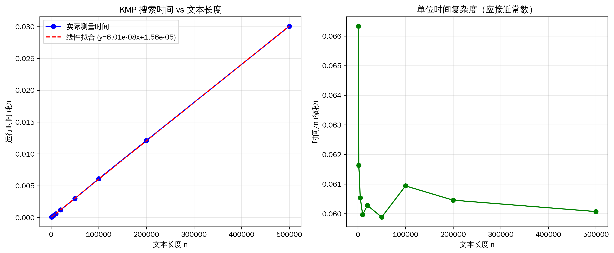
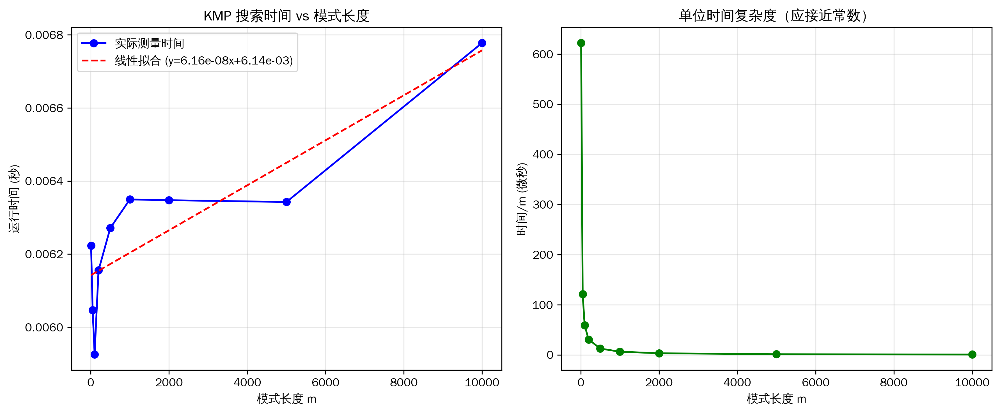
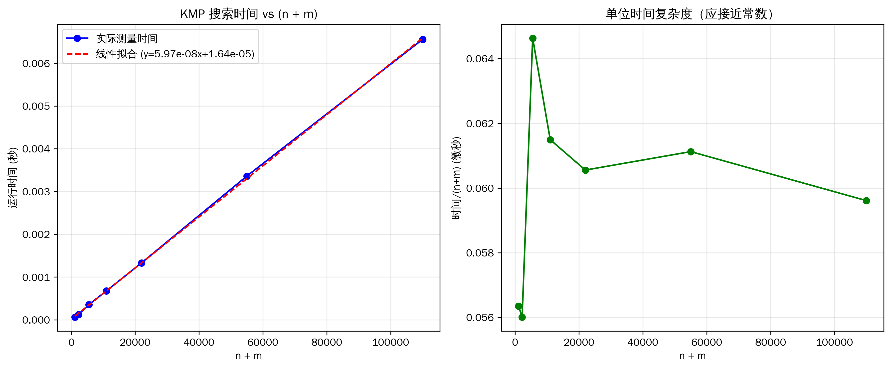
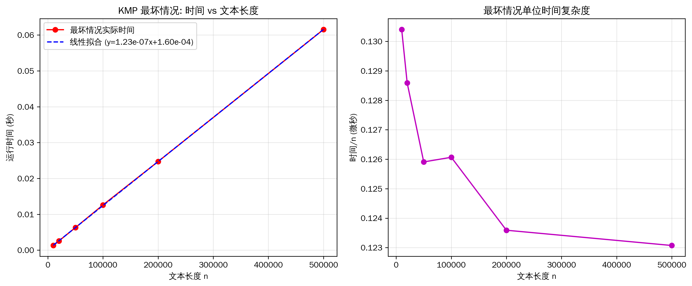
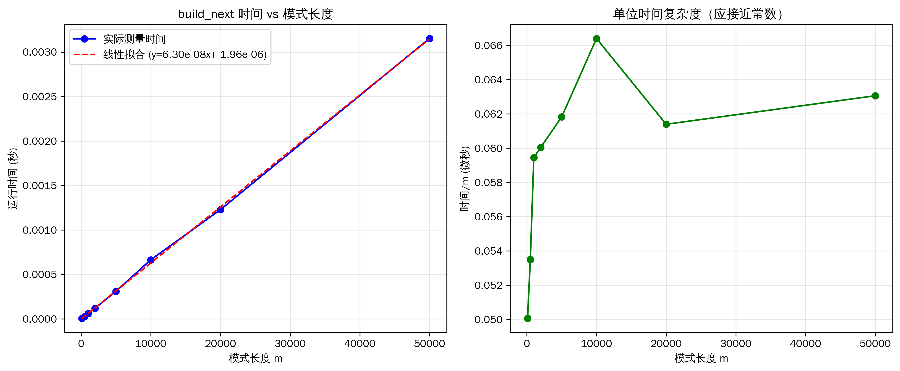

# KMP 字符串匹配算法

## 算法简介

KMP 算法是一种高效的字符串匹配算法，用于在文本串中查找模式串(pattern)的所有出现位置。该算法通过预处理模式串构建部分匹配表（next 数组），避免了朴素算法中的大量重复比较，将时间复杂度从 O(n×m) 优化到 O(n+m)。

## 算法设计思路

### 核心思想

KMP 算法的核心在于利用已经匹配过的信息，避免重复比较：

1. **前缀表（next 数组）**：记录模式串每个位置之前的子串中，最长相等前后缀的长度
2. **失配跳转**：当匹配失败时，根据 next 数组快速确定下一次匹配的起始位置
3. **不回溯文本指针**：文本串的指针始终向前移动，不会回退

### 算法流程

#### 1. 构建 next 数组（`build_next` 函数）

```
目标：计算 pattern[0:i] 的最长相等前后缀长度

算法步骤：
- 初始化：next[0] = 0
- 遍历模式串（i = 1 到 m-1）：
  - 如果 pattern[i] == pattern[j]：匹配成功，j++
  - 如果不匹配：根据 next[j-1] 回退 j，直到匹配或 j=0
  - 记录 next[i] = j

时间复杂度：O(m)
```

**示例**：
```
模式串：A B A B A
next:   0 0 1 2 3

解释：
- next[0] = 0（约定）
- next[1] = 0（"AB" 无相等前后缀）
- next[2] = 1（"ABA" 的前缀"A"等于后缀"A"）
- next[3] = 2（"ABAB" 的前缀"AB"等于后缀"AB"）
- next[4] = 3（"ABABA" 的前缀"ABA"等于后缀"ABA"）
```

#### 2. 字符串匹配（`kmp_search_all` 函数）

```
目标：在文本串中查找所有模式串的出现位置

算法步骤：
- 初始化：j = 0（模式串指针）
- 遍历文本串（i = 0 到 n-1）：
  - 如果 text[i] != pattern[j]：根据 next[j-1] 回退 j
  - 如果 text[i] == pattern[j]：j++
  - 如果 j == m（完全匹配）：
    - 记录匹配位置：i - m + 1
    - 继续查找下一个匹配：j = next[j-1]

时间复杂度：O(n)
总时间复杂度：O(n + m)
```

### 算法优势

- **时间高效**：O(n+m) 线性时间复杂度，即使在最坏情况下也保持线性
- **不回溯**：文本指针不回退，适合处理流式数据
- **空间优化**：只需要 O(m) 的额外空间存储 next 数组

## 环境要求

### 基础运行环境

- **Python**：3.13 , 未在其他环境测试,后文提到的 python 均指 python3
- **操作系统**：Linux 6.12.60-1-lts

### 测试脚本依赖

如需运行复杂度分析脚本，需要安装以下 Python 库：

```bash
pip install matplotlib numpy
```

针对特别的包管理器 pacman：

```bash
pacman -S python-matplotlib python-numpy
```

## 文件说明

```
kmp/
├── kmp.py                        # KMP 算法核心实现
├── run_correctness_tests.sh      # 正确性测试脚本
├── test_complexity.py            # 时间复杂度分析脚本
├── README.md                     # 本文档
└── test_cases/                   # 测试用例目录(ignored)
```

## 代码运行方法

### 1. 基础使用（交互式）

直接运行 `kmp.py` 进行交互式字符串匹配：

```bash
python kmp.py
```

**交互示例**：
```
请输入text: ABABCABABA
请输入pattern: ABA

匹配总次数： 3
每次匹配起始位置： [0, 5, 7]
```

### 2. 在代码中调用

```python
from kmp import kmp_search_all, build_next

# 示例 1：查找所有匹配位置
text = "ABABCABABA"
pattern = "ABA"
positions = kmp_search_all(text, pattern)
print(f"匹配位置：{positions}")  # 输出：[0, 5, 7]

# 示例 2：构建 next 数组
pattern = "ABABC"
next_array = build_next(pattern)
print(f"next 数组：{next_array}")  # 输出：[0, 0, 1, 2, 0]
```

### 3. 正确性测试

运行大规模正确性测试脚本，验证算法的正确性：

```bash
cd kmp
chmod +x run_correctness_tests.sh  # 首次运行需要添加执行权限
./run_correctness_tests.sh
```

**测试内容**：
- 10 个基础测试用例（基本匹配、无匹配、边界情况等）
- 40 个随机生成测试用例（不同规模：100-10000 字符）
- 与 Python 内置 `str.find()` 方法进行结果对比验证

**输出示例**：
```
===================================
KMP 算法大规模正确性测试
===================================

运行基础测试用例...

✓ PASS: 基本匹配
✓ PASS: 无匹配
✓ PASS: 完全匹配
...

随机测试统计: 40/40 通过

===================================
测试结果汇总
===================================
基础测试: 10/10 通过
随机测试: 全部通过

所有测试通过！
```

### 4. 时间复杂度分析

运行复杂度分析脚本，验证算法的 O(n+m) 时间复杂度：

```bash
python test_complexity.py
```

**测试内容**：
1. **文本长度缩放分析**：固定pattern 长度，测试不同文本长度（1K-500K），验证 O(n)
2. **pattern 长度缩放分析**：固定文本长度，测试不同pattern 长度（10-10K），验证 O(m)
3. **组合缩放分析**：同时增加文本和pattern 长度，验证 O(n+m)
4. **最坏情况分析**：高度重复文本，验证最坏情况仍为线性
5. **build_next 复杂度**：单独测试前缀表构建时间

**输出内容**：
- 详细的数值数据表格（时间、单位时间复杂度等）
- 线性拟合公式和相关系数
- 5 张可视化图表（PNG 格式，300 DPI）

**生成的图表文件**：
```
kmp_text_length_scaling.png       # 文本长度缩放分析
kmp_pattern_length_scaling.png    # pattern 长度缩放分析
kmp_combined_scaling.png          # 组合缩放分析 (n+m)
kmp_worst_case.png                # 最坏情况分析
kmp_build_next_complexity.png     # build_next 复杂度分析
```

## 输入输出说明

### 函数接口

#### `build_next(pattern)`

**功能**：构建 KMP 算法的 next 数组（前缀表）

**输入**：
- `pattern` (str)：目标串，要查找的字符串

**输出**：
- `nxt` (list[int])：next 数组，长度为 len(pattern)
  - `nxt[i]` 表示 `pattern[0:i]` 的最长相等前后缀长度

**示例**：
```python
>>> build_next("ABABC")
[0, 0, 1, 2, 0]

>>> build_next("AAAA")
[0, 1, 2, 3]
```

#### `kmp_search_all(text, pattern)`

**功能**：在文本串中查找所有模式串的出现位置

**输入**：
- `text` (str)：文本串，被搜索的字符串
- `pattern` (str)：模式串，要查找的字符串

**输出**：
- `positions` (list[int])：所有匹配的起始位置列表（从 0 开始计数）
  - 空列表表示未找到匹配
  - 位置按升序排列

**特殊情况**：
- 如果 `pattern` 为空字符串，返回 `[0]`
- 如果 `pattern` 长度大于 `text`，返回空列表 `[]`

**示例**：
```python
>>> kmp_search_all("ABABCABABA", "ABA")
[0, 5, 7]

>>> kmp_search_all("AAAA", "AA")
[0, 1, 2]  # 允许重叠匹配

>>> kmp_search_all("ABCDEF", "XYZ")
[]  # 未找到

>>> kmp_search_all("HELLO", "")
[0]  # 空模式串
```

### 交互式程序

运行 `python kmp.py` 时：

**输入格式**：
```
请输入text: <文本串>
请输入pattern: <模式串>
```

**输出格式**：
```
匹配总次数： <匹配数量>
每次匹配起始位置： [位置1, 位置2, ...]
```

**完整示例**：
```
请输入text: She sells seashells by the seashore
请输入pattern: sea

匹配总次数： 2
每次匹配起始位置： [10, 27]
```

## 算法复杂度分析

### 理论复杂度

| 操作 | 时间复杂度 | 空间复杂度 | 说明 |
|------|-----------|-----------|------|
| 构建 next 数组 | O(m) | O(m) | m 为模式串长度 |
| 字符串匹配 | O(n) | O(1) | n 为文本串长度（不含输出） |
| 总体复杂度 | **O(n+m)** | O(m) | 线性时间复杂度 |

### 实验结果分析

通过运行 `test_complexity.py` 进行了 5 组独立实验，对 KMP 算法的时间复杂度进行验证。所有测试使用 4 字符字母表（A、B、C、D）生成随机文本和模式串，每个数据点测量 3-5 次取平均值。

#### 实验 1：文本长度缩放分析

**实验设计**：固定pattern 长度为 100，文本长度从 1K 到 500K

**实验结果**：

| 文本长度 | 运行时间(秒) | 时间/n(微秒) |
|---------|------------|------------|
| 1,000 | 0.000066 | 0.066 |
| 2,000 | 0.000123 | 0.062 |
| 5,000 | 0.000303 | 0.061 |
| 10,000 | 0.000600 | 0.060 |
| 20,000 | 0.001206 | 0.060 |
| 50,000 | 0.002994 | 0.060 |
| 100,000 | 0.006094 | 0.061 |
| 200,000 | 0.012091 | 0.060 |
| 500,000 | 0.030036 | 0.060 |

**分析**：
- **线性相关系数 R = 0.999993**，极高的线性拟合度
- 线性拟合公式：`t = 6.01×10⁻⁸ × n + 1.56×10⁻⁵`
- 时间/n 比值稳定在 **0.060 微秒**，证明时间复杂度为 O(n)
- 即使文本长度增长 500 倍，单位时间保持常数



#### 实验 2：pattern 长度缩放分析

**实验设计**：固定文本长度为 100,000，pattern 长度从 10 到 10,000

**实验结果**：

| pattern 长度 | 运行时间(秒) | 时间/m(微秒) |
|---------|------------|------------|
| 10 | 0.006224 | 622.370 |
| 50 | 0.006047 | 120.938 |
| 100 | 0.005925 | 59.254 |
| 200 | 0.006156 | 30.778 |
| 500 | 0.006271 | 12.543 |
| 1,000 | 0.006350 | 6.350 |
| 2,000 | 0.006348 | 3.174 |
| 5,000 | 0.006343 | 1.269 |
| 10,000 | 0.006778 | 0.678 |

**分析**：
- 运行时间相对稳定，在 6-7 毫秒范围内
- 主要时间花费在搜索阶段（O(n)），构建 next 数组的 O(m) 开销较小
- 当 m << n 时，总体时间由 O(n) 主导
- 验证了 build_next 的高效性



#### 实验 3：组合缩放分析 (n+m)

**实验设计**：同时增加文本和pattern 长度，保持 m = 0.1n

**实验结果**：

| n | m | n+m | 运行时间(秒) | 时间/(n+m)(微秒) |
|---|---|-----|------------|----------------|
| 1,000 | 100 | 1,100 | 0.000062 | 0.056 |
| 2,000 | 200 | 2,200 | 0.000123 | 0.056 |
| 5,000 | 500 | 5,500 | 0.000355 | 0.065 |
| 10,000 | 1,000 | 11,000 | 0.000676 | 0.061 |
| 20,000 | 2,000 | 22,000 | 0.001332 | 0.061 |
| 50,000 | 5,000 | 55,000 | 0.003362 | 0.061 |
| 100,000 | 10,000 | 110,000 | 0.006557 | 0.060 |

**分析**：
- **线性相关系数 R = 0.999918**，验证了 O(n+m) 复杂度
- 线性拟合公式：`t = 5.97×10⁻⁸ × (n+m) + 1.64×10⁻⁵`
- 时间/(n+m) 比值稳定在 **0.060 微秒**
- 完美验证了理论复杂度 O(n+m)



#### 实验 4：最坏情况分析

**实验设计**：高度重复场景
- 文本：全为字符 'A'
- 模式：999 个 'A' + 1 个 'B'（长度 1000）
- 文本长度从 10K 到 500K

**实验结果**：

| 文本长度 | 运行时间(秒) | 时间/n(微秒) |
|---------|------------|------------|
| 10,000 | 0.001304 | 0.130 |
| 20,000 | 0.002572 | 0.129 |
| 50,000 | 0.006295 | 0.126 |
| 100,000 | 0.012607 | 0.126 |
| 200,000 | 0.024718 | 0.124 |
| 500,000 | 0.061536 | 0.123 |

**分析**：
- **线性相关系数 R = 0.999993**，即使在最坏情况下仍保持线性
- 时间/n 比值约为 **0.125 微秒**，是普通情况的 2 倍
- 最坏情况下的常数因子增加，但仍然是线性复杂度
- 证明 KMP 算法在任何情况下都不会退化



#### 实验 5：build_next 函数复杂度

**实验设计**：单独测试 next 数组构建时间

**实验结果**：

| pattern 长度 | 运行时间(秒) | 时间/m(微秒) |
|---------|------------|------------|
| 100 | 0.000005 | 0.050 |
| 500 | 0.000027 | 0.053 |
| 1,000 | 0.000059 | 0.059 |
| 2,000 | 0.000120 | 0.060 |
| 5,000 | 0.000309 | 0.062 |
| 10,000 | 0.000664 | 0.066 |
| 20,000 | 0.001228 | 0.061 |
| 50,000 | 0.003153 | 0.063 |

**分析**：
- **线性相关系数 R = 0.999860**，完美的线性关系
- 线性拟合公式：`t = 6.30×10⁻⁸ × m - 1.96×10⁻⁶`
- 时间/m 比值稳定在 **0.060 微秒**
- 验证了 build_next 的 O(m) 时间复杂度



### 实验结论

1. **线性时间复杂度得到验证**：
   - 所有实验的线性相关系数 R > 0.9998
   - 单位时间复杂度保持常数（约 0.06 微秒）

2. **算法稳定性极佳**：
   - 即使在最坏情况下也保持线性
   - 不存在性能退化

3. **实际性能优秀**：
   - 处理 500K 字符文本仅需 30ms
   - 构建 50K 长度模式的 next 数组仅需 3ms

4. **复杂度分解验证**：
   - O(n+m) = O(n) + O(m)
   - 搜索阶段：O(n)，约 0.06 微秒/字符
   - 构建阶段：O(m)，约 0.06 微秒/字符

## 应用场景

1. **文本搜索**：在大型文档中快速查找关键词
2. **DNA 序列匹配**：在基因序列中查找特定模式
3. **数据流处理**：实时监控流数据中的特定模式
4. **编译器词法分析**：识别源代码中的关键字和标识符
5. **入侵检测系统**：在网络流量中匹配攻击特征

## 常见问题

### Q1: KMP 算法与朴素算法的区别？

**朴素算法**：
- 时间复杂度：O(n×m)
- 失配时文本指针回退，重复比较

**KMP 算法**：
- 时间复杂度：O(n+m)
- 文本指针不回退，利用已匹配信息

### Q2: 为什么 next 数组能避免重复比较？

next 数组记录了模式串的自相似性。当失配时，我们知道之前已经匹配的部分中，哪些前缀等于后缀，可以直接跳过这些已知相等的部分。

### Q3: KMP 算法适用于所有字符串吗？

是的，KMP 算法适用于任何字符集的字符串，包括：
- ASCII 字符
- Unicode 字符（中文、日文等）
- 二进制数据

### Q4: 如何处理大小写敏感/不敏感匹配？

```python
# 大小写不敏感匹配
text_lower = text.lower()
pattern_lower = pattern.lower()
positions = kmp_search_all(text_lower, pattern_lower)
```

## 参考资料

- Knuth, D.E., Morris, J.H., and Pratt, V.R. (1977). "Fast Pattern Matching in Strings"
- 算法导论（Introduction to Algorithms），第 32 章：字符串匹配


---

**最后更新日期**：2025-12-08
